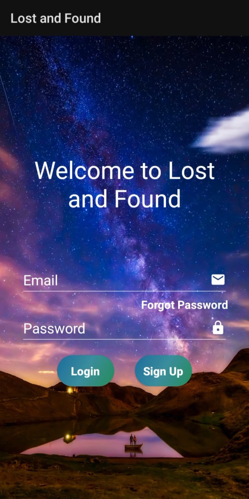
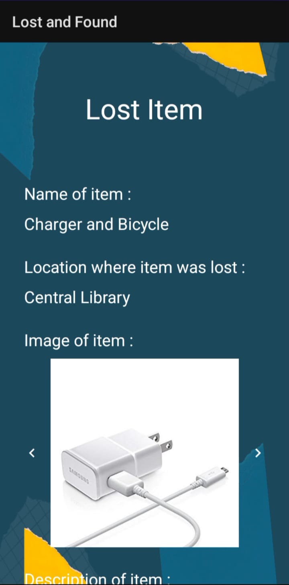

# Lost and Found App


---

The Lost and Found App is a user-friendly mobile application designed for IITP students to streamline the process of reporting lost items, connecting users with their rightful belongings, and facilitating item recovery.

Built with efficiency and convenience in mind, this app aims to provide a seamless experience for both users who have lost their belongings and individuals who have found lost items. Leveraging cutting-edge technologies and a robust backend infrastructure, the Lost and Found App allows users to report their lost items, browse through found items, and easily connect with the respective owners.

The app enables swift identification and retrieval of lost items, fostering a reliable and efficient lost and found ecosystem. Whether it's a misplaced wallet, a forgotten bag, or a valuable possession, the Lost and Found App is the go-to platform for users to reclaim their belongings, bringing peace of mind and reuniting people with their cherished possessions.

## Screenshots

<p float="left">
  
   
</p>

## Technologies Used

The app has been built with Kotlin and utilizes Firebase utilities, such as Firebase Authentication, Firestore, and Storage, to provide a robust and scalable backend infrastructure.

## Features

- **Report Lost Items**: Users can easily report their lost items by providing relevant details such as item description, location, and contact information.

- **Browse Found Items**: Users can browse through a list of found items to identify and claim their lost belongings.

- **Connect with Owners**: The app facilitates seamless communication between users who have lost items and those who have found them, enabling swift item recovery.

- **Secure Authentication**: Firebase Authentication ensures secure user authentication, safeguarding user data and privacy.

- **Scalable Backend**: Leveraging Firebase Firestore and Storage, the app offers a scalable backend infrastructure to handle a large volume of user data and media files.

## Getting Started

To get started with the Lost and Found App, follow these steps:

1. Clone the repository:
   ```bash
   git clone https://github.com/Atul-AI08/Lost_and_Found.git
   ```

2. Open the project in Android Studio.

3. Set up Firebase for the project and add the required configuration files.

4. Build and run the app on your Android device or emulator.

## License

This project is licensed under the [MIT License](LICENSE). Feel free to use, modify, and distribute the app according to the terms of the license.
